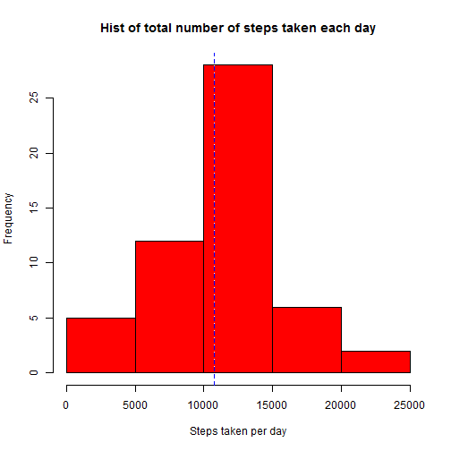
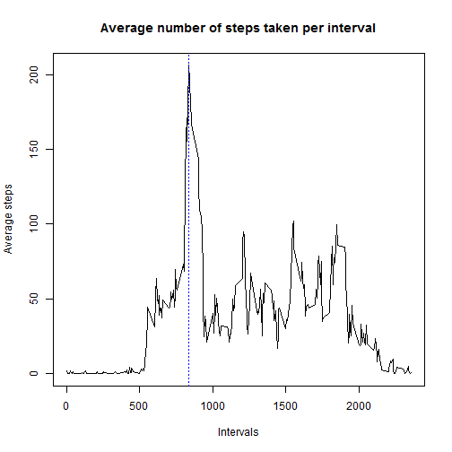
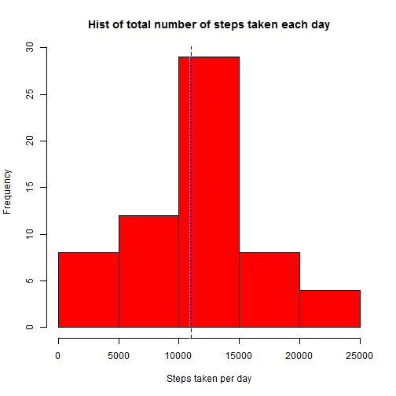
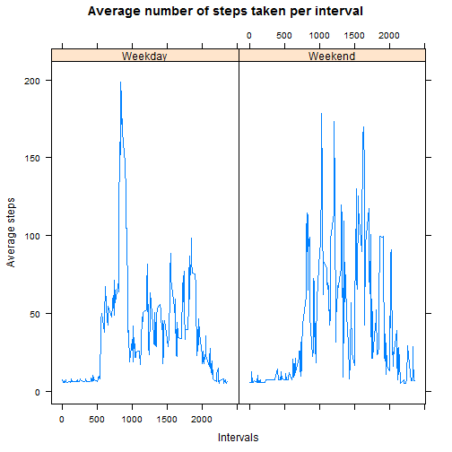

# Reproducible Research: Peer Assessment 1


## Loading and preprocessing the data

In order to reproduce the results the file `"activity.csv"` has to be placed in the working directory.
Once the dataset is loaded from the file, its column `"date"` gets casted to `Date` type


```r
dataset<-read.csv(file="activity.csv")

dataset$date<-as.Date(dataset$date)
```

Here a summary of the loaded data:


```r
summary(dataset)
```

```
##      steps            date               interval   
##  Min.   :  0.0   Min.   :2012-10-01   Min.   :   0  
##  1st Qu.:  0.0   1st Qu.:2012-10-16   1st Qu.: 589  
##  Median :  0.0   Median :2012-10-31   Median :1178  
##  Mean   : 37.4   Mean   :2012-10-31   Mean   :1178  
##  3rd Qu.: 12.0   3rd Qu.:2012-11-15   3rd Qu.:1766  
##  Max.   :806.0   Max.   :2012-11-30   Max.   :2355  
##  NA's   :2304
```


## What is mean total number of steps taken per day?

The following code makes a histogram of the total number of steps taken each day: 


```r
agg_dataset<-aggregate(dataset$steps~dataset$date, data=dataset, FUN=sum, NA.rm=TRUE)

colnames(agg_dataset)<-c("date","steps")

hist(agg_dataset[,2], xlab="Steps taken per day", main="Hist of total number of steps taken each day", col=2)

steps_mean <- mean(agg_dataset$steps, na.rm = TRUE)

steps_median <- median(agg_dataset$steps, na.rm = TRUE)

abline(v=steps_mean, col = c("white"), lty=3)

abline(v=steps_median, col = c("blue"), lty=2)
```

 

The mean and median total number of steps taken per day are shown in the istogram and are reported below:


```r
steps_mean
```

```
## [1] 10767
```

```r
steps_median
```

```
## [1] 10766
```

## What is the average daily activity pattern?

The following code makes a time series plot of the 5-minute interval (x-axis) and the average number of steps taken, averaged across all days (y-axis)


```r
agg_dataset<-aggregate(dataset$steps~dataset$interval, data=dataset, FUN=mean, NA.rm=TRUE)

colnames(agg_dataset)<-c("interval","average_steps")

plot(agg_dataset[,1],agg_dataset[,2],xlab="Intervals", ylab="Average steps", main="Average number of steps taken per interval", type="l")

abline(v=agg_dataset[agg_dataset$average_steps==max(agg_dataset$average_steps),1], col = c("blue"), lty=3)
```

 

The 5-minute interval, on average across all the days in the dataset, containing the maximum number of steps is reported below:


```r
agg_dataset[agg_dataset$average_steps==max(agg_dataset$average_steps),]
```

```
##     interval average_steps
## 104      835         206.2
```

## Imputing missing values

The dataset contains few missing values. Below is shown the number of observations with missing value:


```r
nrow(dataset[is.na(dataset$steps),])
```

```
## [1] 2304
```

The missing values get now filled with the average value for their interval respectively. A new dataset is created containing where missing values are replaced with their rounded average.


```r
tmp_dataset<-merge(x = dataset, y = agg_dataset, by = "interval", all.x=TRUE)

new_dataset<-dataset

new_dataset$steps <- round(ifelse(is.na(dataset$steps), tmp_dataset$average_steps, dataset$steps))
```

A new histogram of the total number of steps taken each day is then drawn:


```r
agg_dataset<-aggregate(new_dataset$steps~dataset$date, data=new_dataset, FUN=sum, NA.rm=TRUE)

colnames(agg_dataset)<-c("date","steps")

hist(agg_dataset[,2], xlab="Steps taken per day", main="Hist of total number of steps taken each day", col=2)

steps_mean <- mean(agg_dataset$steps, na.rm = TRUE)

steps_median <- median(agg_dataset$steps, na.rm = TRUE)

abline(v=steps_mean, col = c("white"), lty=3)

abline(v=steps_median, col = c("blue"), lty=2)
```

 

Obviously the mean and median total number of steps taken per day increase.


```r
steps_mean
```

```
## [1] 10890
```

```r
steps_median
```

```
## [1] 11016
```

## Are there differences in activity patterns between weekdays and weekends?

A new variable is created containing the type of day (i.e. weekday or weekend) and then added to the new dataset created. The dataset gets then aggregated by interval and type of day in order to compare the average number of steps taken during weekdays and weekends.

A new plot containing a time series of the 5-minute interval (x-axis) and the average number of steps taken shows the difference in activity patterns between weekdays and weekends:


```r
library(lattice)

new_dataset$type_of_day<-ifelse(weekdays(new_dataset$date) %in% c("Sunday","Suturday"),"Weekend","Weekday")

agg_dataset<-aggregate(new_dataset$steps~new_dataset$interval+new_dataset$type_of_day, data=new_dataset, FUN=mean, NA.rm=TRUE)

colnames(agg_dataset) <- c("interval", "type_of_day", "average_steps")

xyplot(average_steps ~ interval | type_of_day, agg_dataset, type = "l", main = "Average number of steps taken per interval", ylab = "Average steps", xlab = "Intervals")
```

 
